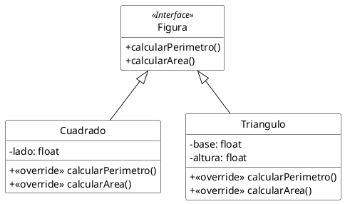

<!--

```plantuml 
@startuml
skinparam monochrome true
skinparam classBackgroundColor White
skinparam classBorderColor Black
skinparam shadowing false
skinparam classAttributeIconSize 0

Figura <|-- Cuadrado
Figura <|-- Triangulo

class Figura <<Interface>> {
 +calcularPerimetro()
 +calcularArea()
}

class Cuadrado {
 -lado: float
 + <<override>> calcularPerimetro()
 + <<override>> calcularArea()
}

class Triangulo {
 -base: float
 -altura: float
 + <<override>> calcularPerimetro()
 + <<override>> calcularArea()
}

hide circle
hide <<Interface>> fields
@enduml
```
-->

# Diagrama de clases

