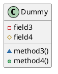

<!--

```plantuml 
@startuml
class Dummy {
 -field1
 #field2
 ~method1()
 +method2()
}
@enduml 
```
-->

<!--

```plantuml 
@startuml
class Dummy {
 -field3
 #field4
 ~method3()
 +method4()
}
@enduml 
```
-->

# Diagrama 1

# Diagrama 2

